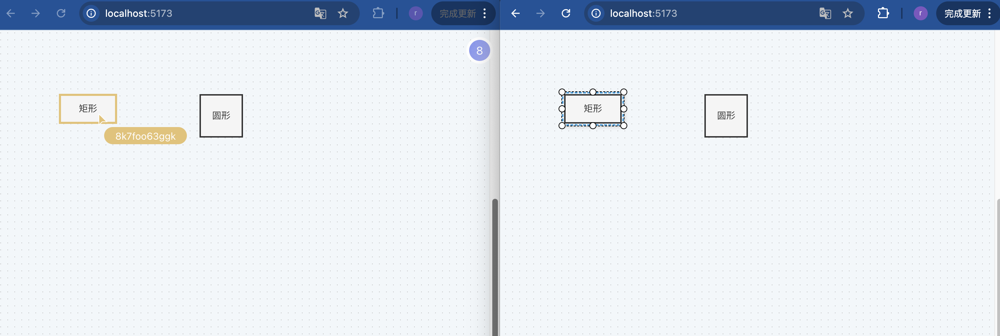

# X6-based Collaborative Graph Editor

This project is a real-time collaborative graph editor built on top of the X6 graph visualization library. It allows multiple users to simultaneously create, edit, and view graph structures, demonstrating the power of real-time collaboration in a visual editing environment.

## Features

- X6-powered graph editing: Utilize the powerful features of X6 for graph manipulation
- Real-time collaboration: Multiple users can work on the same graph simultaneously
- Cursor tracking: See other users' cursors in real-time
- User awareness: Display avatars of connected users

## Technology Stack

### Frontend

- Vue 3: Progressive JavaScript framework for building user interfaces
- X6: Powerful graph visualization and editing library
- Yjs: CRDT framework for building collaborative applications

### Backend

- Node.js: JavaScript runtime for server-side development
- Hocuspocus: Real-time collaboration backend for Yjs

### Collaboration

- @hocuspocus/provider: Client-side provider for Hocuspocus
- @hocuspocus/server: Server-side implementation of Hocuspocus

## References

- Hocuspocus Documentation: [https://tiptap.dev/docs/hocuspocus/introduction](https://tiptap.dev/docs/hocuspocus/introduction)
- Yjs Documentation: [https://docs.yjs.dev/](https://docs.yjs.dev/)
- X6 API Documentation: [https://x6.antv.antgroup.com/api/graph/graph](https://x6.antv.antgroup.com/api/graph/graph)

## License

This project is licensed under the MIT License.

